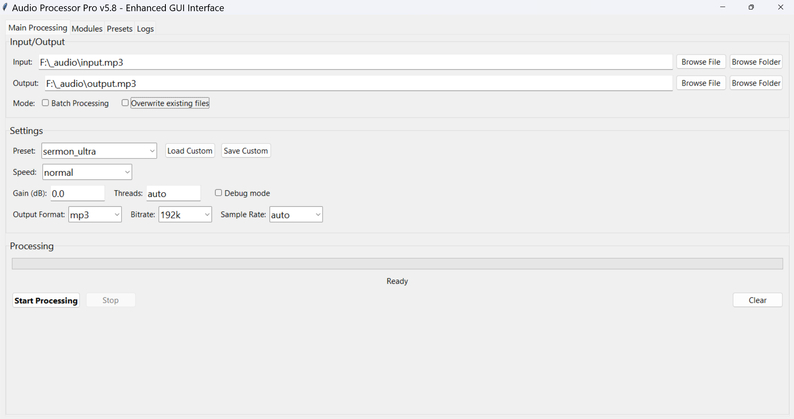
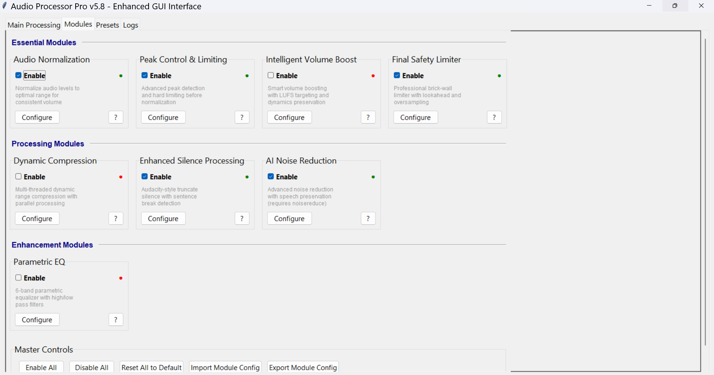
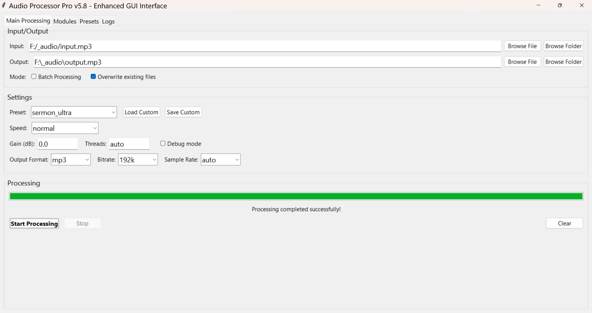
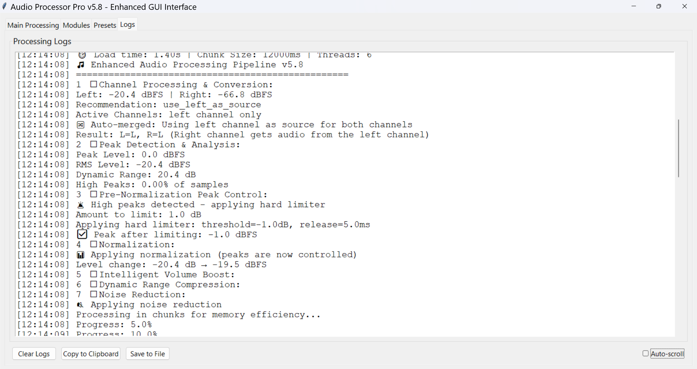

# Audio Processor Pro v5.8

Professional audio processing tool with enhanced GUI interface for sermon, podcast, and broadcast audio.

## Features

- **Peak Control & Hard Limiting**: Advanced peak detection before normalization
- **Intelligent Volume Boost**: LUFS-based volume optimization
- **Enhanced Silence Processing**: Audacity-style truncate silence with sentence break detection
- **Multi-threaded Processing**: Fast parallel processing for large files
- **Parametric EQ**: 6-band equalizer with filters
- **Noise Reduction**: AI-powered noise removal
- **Dynamic Compression**: Professional compression with parallel processing

## Processing Pipeline

The audio processing follows this exact order:

1. **Channel Processing & Conversion**
   - Stereo channel analysis
   - Mono to stereo conversion
   - Channel merging (if needed)

2. **Peak Detection & Analysis**
   - Analyze peak levels
   - Calculate RMS and dynamic range
   - Identify high peaks

3. **Pre-Normalization Hard Limiting**
   - Apply hard limiter if peaks detected
   - Prevent clipping before normalization

4. **Normalization**
   - Normalize to optimal level
   - Consistent volume baseline

5. **Intelligent Volume Boost** (Optional)
   - LUFS-based loudness targeting
   - Adaptive gain calculation
   - Dynamic range preservation

6. **Dynamic Range Compression** (Optional)
   - Multi-threaded processing
   - Parallel compression support

7. **Noise Reduction** (Optional)
   - AI-powered spectral processing
   - Speech preservation mode

8. **Silence Processing** (Optional)
   - Leading silence (disabled by default)
   - Trailing silence (enabled by default)
   - Internal silence compression
   - Sentence break detection

9. **Parametric EQ** (Optional)
   - Multi-band equalization
   - High/low pass filters

10. **Final Safety Limiter** (Optional)
    - Brick-wall limiting
    - Prevents any clipping

11. **Pre-Export Volume Boost** (Optional)
    - Final volume adjustment
    - Safety peak check

12. **Export**
    - Format conversion
    - Bitrate/sample rate adjustment

## Installation

### Requirements
- Python 3.7 or newer
- FFmpeg installed and in PATH

### Install Dependencies

```bash
pip install pydub numpy scipy noisereduce psutil
```

Windows

Install Python dependencies
```bash
pip install pydub numpy scipy noisereduce psutil
```

# Download FFmpeg from https://ffmpeg.org/
# Extract and add to system PATH
macOS
Install dependencies
```bash
pip3 install pydub numpy scipy noisereduce psutil
```

# Install FFmpeg using Homebrew
```bash
brew install ffmpeg
```
# Python should include tkinter by default
# Test with: python3 -m tkinter
### Linux (Ubuntu/Debian)
### Install tkinter (required for GUI)
```bash
sudo apt-get update
sudo apt-get install python3-tk
```

# Install FFmpeg
```bash
sudo apt-get install ffmpeg
```
# Install Python dependencies
```bash
pip3 install pydub numpy scipy noisereduce psutil
```
### Linux (Fedora/CentOS)
```bash
sudo dnf install python3-tkinter ffmpeg
pip3 install pydub numpy scipy noisereduce psutil
```
### Verify Installation

### Check Python version
```bash
python --version  # or python3 --version
```
# Check FFmpeg
```bash
ffmpeg -version
```
# Test tkinter (for GUI)
```bash
python -m tkinter  # or python3 -m tkinter
```
### Quick Start
### GUI Interface (Recommended)
# Windows
```bash
python audio_processor_gui.py
```
# macOS/Linux
```bash
python3 audio_processor_gui.py
```
### Command Line Interface
# Basic usage
```bash
python audio_processor_pro-v5.8.py input.mp3 output.mp3
```

# With preset
```bash
python audio_processor_pro-v5.8.py input.mp3 output.mp3 --preset sermon_ultra
```
# Batch processing
```bash
python audio_processor_pro-v5.8.py "*.mp3" --batch --preset podcast_pro
```

### The GUI provides an intuitive interface with:
### Screenshots

### GUI Main Interface


### Module Configuration


### Processing View


### Processing Logs


# Visual module configuration
Preset management
Real-time processing logs
Batch processing support

# Command Line Interface
Basic Usage
```bash
# Process with default sermon preset
python audio_processor_pro-v5.8.py input.mp3 output.mp3

# Use specific preset
python audio_processor_pro-v5.8.py input.mp3 output.mp3 --preset podcast_pro

# Add gain boost
python audio_processor_pro-v5.8.py input.mp3 output.mp3 --preset sermon_ultra --gain 6.0
```
Silence Processing Control
```bash
# Default: Trailing silence only (safe)
python audio_processor_pro-v5.8.py input.mp3 output.mp3

# Disable leading silence trimming (recommended for recordings)
python audio_processor_pro-v5.8.py input.mp3 output.mp3 --no-trim-leading

# Disable trailing silence trimming
python audio_processor_pro-v5.8.py input.mp3 output.mp3 --no-trim-trailing
```
# Disable all silence processing
python audio_processor_pro-v5.8.py input.mp3 output.mp3 --no-silence-processing
Batch Processing
```bash
# Process all MP3 files in current directory
python audio_processor_pro-v5.8.py "*.mp3" --batch --preset broadcast_pro --overwrite

# Process specific folder
python audio_processor_pro-v5.8.py "/path/to/audio/files/*.mp3" --batch
```
Advanced Options
```bash
# Custom output format and quality
python audio_processor_pro-v5.8.py input.wav output.mp3 \
  --format mp3 \
  --bitrate 320k \
  --sample-rate 48000

# Fast processing mode
python audio_processor_pro-v5.8.py input.mp3 output.mp3 \
  --speed-preset fast \
  --threads 8

# Disable specific modules
python audio_processor_pro-v5.8.py input.mp3 output.mp3 \
  --no-compression \
  --no-noise-reduction \
  --disable-eq
```

# Channel analysis only
python audio_processor_pro-v5.8.py input.mp3 --channel-analysis
Using Custom Configuration
```bash
# Save current settings
python audio_processor_pro-v5.8.py input.mp3 output.mp3 \
  --preset sermon_ultra \
  --save-config my_config.json

# Load saved settings
python audio_processor_pro-v5.8.py input.mp3 output.mp3 \
  --load-config my_config.json
```
Available Presets
sermon_ultra
Premium sermon processing with enhanced silence truncation

Aggressive silence removal while preserving speech flow
Voice enhancement EQ
Strong compression for consistent levels
Default: Trailing silence only

broadcast_pro
Professional broadcast quality

Moderate processing for natural sound
Broadcast-standard loudness levels
Balanced EQ

podcast_pro
High-quality podcast processing

Voice clarity optimization
Consistent loudness
Natural dynamics preservation

music_mastering
Professional music mastering

Minimal silence processing
Transparent dynamics control
Wide stereo image

Module Configuration
Each module can be configured independently through the GUI or command line:
Silence Processing

Leading Silence: Start of audio (disabled by default - may cut important content)
Trailing Silence: End of audio (enabled by default)
Internal Silence: Within audio (enabled by default)
Sentence Break Detection: Smart preservation of natural pauses

Peak Control

Pre-normalization peak limiting
Prevents digital clipping
Configurable threshold and release

Volume Boost

LUFS-based loudness targeting
Adaptive gain calculation
Dynamic range preservation

Compression

Multi-threaded processing
Parallel compression support
Configurable threshold, ratio, attack, release

Noise Reduction

AI-powered spectral processing
Speech preservation mode
Configurable strength

Common Workflows
Sermon Processing
```bash
python audio_processor_pro-v5.8.py sermon.mp3 sermon_processed.mp3 \
  --preset sermon_ultra \
  --gain 8.0 \
  --no-trim-leading
```
Podcast Episode
```bash
python audio_processor_pro-v5.8.py podcast.wav podcast.mp3 \
  --preset podcast_pro \
  --format mp3 \
  --bitrate 192k \
  --no-trim-leading
```
Batch Process Recordings
```bash
python audio_processor_pro-v5.8.py "recordings/*.wav" \
  --batch \
  --preset broadcast_pro \
  --format mp3 \
  --overwrite
```
Music File
```bash
python audio_processor_pro-v5.8.py song.wav song_mastered.flac \
  --preset music_mastering \
  --format flac \
  --no-silence-processing
```
Troubleshooting
FFmpeg Not Found
# Windows: Download from https://ffmpeg.org/ and add to PATH
# Linux: sudo apt-get install ffmpeg
# macOS: brew install ffmpeg
Low Volume Output

Increase gain: --gain 6.0
Enable volume boost in GUI
Check peak control settings

Audio Quality Issues

Use higher bitrate: --bitrate 320k
Use lossless format: --format flac
Reduce noise reduction strength
Disable fast mode

Silence Cut Too Much

Disable leading silence: --no-trim-leading
Increase silence threshold in GUI (e.g., -30 dB → -40 dB)
Increase minimum silence duration

License
MIT License - See LICENSE file for details.
Contributing
Contributions are welcome! Please feel free to submit a Pull Request.
